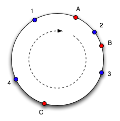
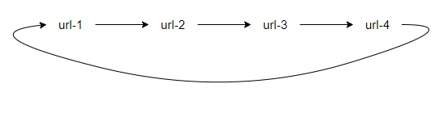
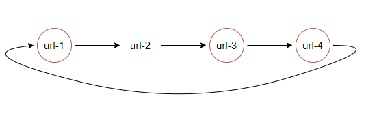
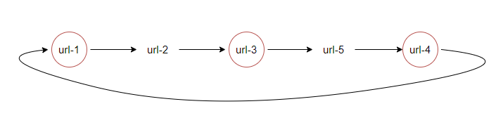
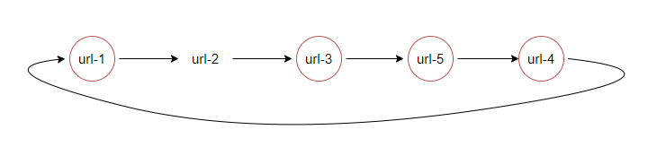
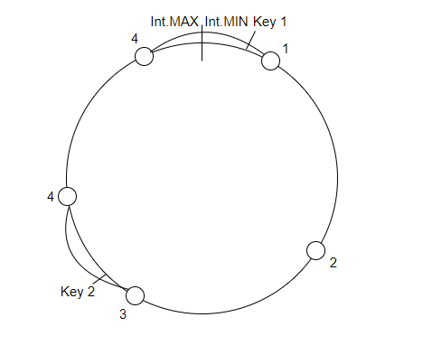
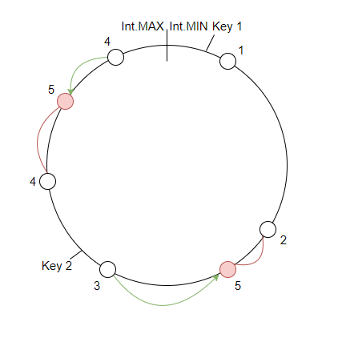

# Отчет Stage 7 Bonus
Консистентное хэширование с добавлением и удалением узлов и переносом ключей без перезапуска кластера.
Реализация весьма простая и предполагает изменение кластера по одной ноде.

## Взаимодействие с программой

Первое для данного проекта для запуска нужно заменить в ```build.gradle``` ```mainClass``` на ```'ok.dht.test.kuleshov.Server'```

Опции:
1. ```-p <port>``` указывает на каком локальном порту запускается сервер.
2. ```-a``` указывает что это узел, который запускается является новым уже в существующем кластере 
вместе с ним обязательно указывается опция -u.
3. ```-u <url>``` указывает у какого узла необходимо запросить текущую конфигурацию кластера.`
4. ```-h  <hash1> <hash2> ...``` опциональный параметр указывает какие хэши (через пробел) необходимо соотнести виртуальным узлам новой ноды.
Если не указан, то по дефолу генерируется 4 по алгоритму ниже.

Запускается командой ```gradle run --args="<опции>"```

Примеры:
1. Запуск первого узла ```gradle run --args="-p 19234"```
2. Запуск второго узла в готовый кластер ```gradle run --args="-a -u http://localhost:19234 -p 19666"```
3. Запуск второго узла в готовый кластер c виртуальными нодами с хэшами 0 и 1000
4. ```gradle run --args="-a -u http://localhost:19666 -p 19667 -h 0 1000"```

Дополнительное HTTP API:
1. ```/v0/maindeletenode``` удаляет узел на который отправлен запрос из кластера, т.е. 
```
curl --location -v --request GET 'http://localhost:19666/v0/maindeletenode' --header 'Content-Type: text/plain'
```
удалит узел ```http://localhost:19666``` из его кластера.
2. ```/v0/cluster-config``` запрашивает текущую конфигурацию класстера, пример 
```
curl --location -v --request GET 'http://localhost:19666/v0/cluster-config' --header 'Content-Type: text/plain'
```
может вернуть такой json
```
{"urlToHash":{"http://localhost:19234":[1894906372,-1217789564,-511636176,286163921],"http://localhost:19666":[-898821511,1244601444,-2112654767,-204944282]}}
```

## Консистентное хеширование



Метод распределения ключей по узлам кластера, где каждому узлу соответсвтует отрезок на окружности, сама окружность
от ```Integer.MIN_VALUE``` до ```Integer.MAX_VALUE```. А расположение ключа на окружности определяется по хешу ключа,
в моей реализации используется Hash.murmur3. Распределение отрезков между узлами определяется с учетом виртуальных нод
считается ```Hash.murmur3(<url узла> + "|" + i)```, где i - номер виртуальной ноды и далее этому узлу достается отрезок 
от минимального хэша других нод до высчитанного хэша.
## Добавление узла
Реализованно путем запуска сервера, который затем запрашивает у указанного узла конфигурацию кластера.
Запущенный узел добавляет узел в свою конфигурацию, затем отправляет всем остальным узлам сообщение о добавлении
нового узла, когда новый узел получает такое сообщение, он добавляет в свою конфигурацию и по необходимости передает 
ключи новому узлу, блокируя (отвечая 504) все операции по передаваемому отрезку до конца передачи, после конца передачи,
отправляется сообщение о конце, после чего новый узел может отвечать на запросы по этому отрезку.

По дефолту создается 4 виртуальных узла для одного реального по алгоритму из пункта выше. Но есть и возможность ручного 
выбора хэшей для вставки узла, то есть выбора места на окружности для вставки узла, что позволит вручную распределять
нагрузку между узлами. И например можно таким образом снять нагрузку с более слабых или более нагруженных узлов, добавив
новый узел или просто добавив виртуальную ноду.
## Удаление узла
Удаление происходит аналогично добавлению, но удаление происходит по определенному запросу к удаляемому узлу, далее
он отправляет запросы удаления себя остальным узлам класстера. После этого запускается перенос ключей, после которого
можно отключать узел.
## Перенос ключей
Перенос ключей осуществляется с помощью двух сервисов ```TransferSenderService``` и ```TransferReceiverService``` 
для отправки и приема ключей соответсвенно. Во время переноса блокируется весь переносимый отрезок,
во избежания создания различий в данных. Перенос происходит последовательно. Так как распределние по нодам использует 
хэш, то необходимо прочтение всех ключей ноды отправителя. Можно было бы оптимизировать это добавлением поля хэша
и некоторого индекса по этому полю, тогда можно было бы сразу перебирать только ключи, входящие в переносимый отрезок.
## Вывод
Модификация позволяет добавлять и удалять узлы, более точно рапределяя нагрузку по узлам кластера, однако стоит
доработать перенос, блокируя меньшее количество ключей используя блокировки на конкретные ключи
и использовать Chunked transfer encoding для более быстрой отправки.

## Репликация
Чтобы починить репликацию с ```ack``` и ```from```, рассмотрим текущий алгоритм выбора нод для репликации.
Сейчас для этого хранится отсортированный список всех url-ов узлов, первый узел выбирается из распределения консистентного
хэширования, а остальные брались следующие за ним, если следующих не хватало, то нехватающую часть брали из начала списка.



То есть на этой картинке для примера ```put id ack=3``` и ```consistent_hashing(id) = url-3``` (то есть ключ изначально находится 
на ```url-2```), будут выбраны: ```url-3``` ```url-4``` ```url-1```, красным выделены ноды, на которые сохранили. 



В чем же проблема? А проблема в том, что если новый узел для для примера окажется между ```url-3``` и ```url-4```



то по текущему алгоритму будут выбраны: ```url-3``` ```url-5``` ```url-4```. Однако на ```url-5``` нет нужного ключа,
что ломает нам надежность на запросе ```get id ack=3```.

Введем понятие **реплицированного ключа на ноде K**, это ключ, который по консистентному хэшированию не должен храниться
на ноде K (```consistent_hashing(id) != K```), но он там хранится в следствии репликации.

Простое решение проблемы - перенесем на добавленную ноду все реплицированные ключи, которые хранятся на следующей ноде.
Для нашего примера получим.



Аналогично это решит проблему, для любого подсписка нод, в который добавилась нода. Это обеспечивает данные гарантии, 
что для запроса ```put id ack=n```, ```get id ack=n```, в случае, если не происходило падения нод, вернет корректный результат.

Однако остается проблема лишних ключей, и её так просто не решить. Для нашего примера, на ```url-1```, остался ключ,
которого в новой конфигурации там быть не должно. Проблема в том, что реплицированных ключей на ```url-1```, мы не сможем определить какие ключи 
необходимо удалить. Потому что реплицированные ключи могли храниться как на пути ```url-3``` ```url-4``` ```url-1``` и тогда
удалить надо, а могли харниться на ```url-4``` ```url-1```, тогда удалять не надо. Соответсвенно, что бы мы смогли удалять лишние данные
необходимо для каждого реплицированного узла, сохранять и данные о том где он еще хранится, и при добавлении новой ноды,
на каждом узле запускать проверку всех реплицированных ключей, нужно ли удалять или нет. Что вообще не очень дешево.

Таким образом восстановление гарантий при добавлении можно решить простым копированием со следующего узла, а проблему лишних оставшихся
ключей, только с помощью хранения дополнительной информации и запуска большой проверки.

С удалением ситуация похожа на, то что мы не знаем какие ключи удалять, только тут мы не знаем, какие реплицированные
ключи необходимо на какие узлы переносить. Выходом также является дополнительное хранение информации о пути, по которому реплицируем ключ.
И даже это полностью не решит проблемы, так как для ```ack=n```, где ```n``` количество узлов, после удаления узла, мы никак не
сможем дать такой гарантии, так как максимальной гарантией будет ```n-1```

### Тут я осознал
что просто хранить отсортированные url'ы недостаточно, так как на новую ноду тоже переезжают ключи, и для них вообще все
гарантии могут слететь, чтобы такого не случалось давайте брать не отсортированные url'ы, а будем строить такой же граф 
как на примере, а следующим будем считать для ноды следующую, в плане консистентного хэширования ноду. Однако, так
как у нас есть виртуальные ноды, следующей может быть не одна нода))) Давайте посмотрим на рисуночки.



Здесь нарисовано 3 реальные ноды (1, 2, 3) и 4 виртуальные (у 4-ки 2 виртуальные ноды), рассмотрим ```put key 2 ack=2``` по консистентному
хэшированию находится на ноде 4, идем по часовой стрелке, следующей нодой также является 4-ка, но так как мы на неё уже 
записали она нам не интересна, идем дальше, там нода 1, на нее не записывали, значит берем, отлично, собрали ```ack=2```.
Для ключа ```key 1``` и ```ack=2```,  по консистентному хэшированию он попадет на ноду 1 и дальше отреплицируется на 2.

Рассмотрим добавление.



Здесь 5 - новая нода, красные дуги, отрезки, которые по консистентному хэшированию относятся к новому узлу,
зеленые стрелочки - означают перенос отреплицированных ключей на 5 ноду, помимо тех, что перенеслись из красного отрезка.
То есть здесь следующими для новой ноды являются 4 и 3, и с них необходимо перенести реплицированные ключи.

Проблемы с удалением ненужных реплицированных ключей и удалением нод здесь также остаются и также решаются,
путем сохранения информации о пути, только теперь заданого на таком круге, и перебором на каждом узле, каждого ключа.

